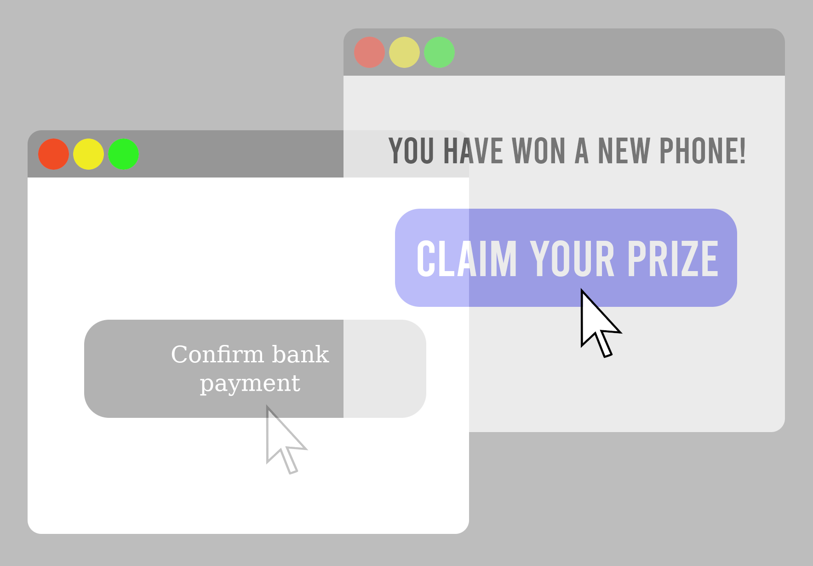

# Clickjacking
### Ivan Wang

Clickjacking is also known as UI redressing attack. It is a technique where the attacker tricks the user into clicking a hidden element, or trick the user into believing that they are clicking an actual part of the page while redirecting their clicks to something malicious. This can typically be done by overlaying invisible or opacitiy 0 elements over existing elements and making sure that it is over the legit buttons therefore making the user click the wrong button or anything else unknowningly.

## Types of Clickjacking bugs

## Transparent Overlay

The type that was focuse in the challenges was transparent overlay. This type of attack is done by overlaying an invisible element over an visible legit looking in order to trick the user into clicking it. This can be done by either creating an iframe where within, another website can be open up, or the usual average button works too. It is turned invisible by changing the display and opacitiy in css, then carefully place over the legit buttons or text boxes so that when a user attempts to interact with the legitimate elements, they'll instead touch the malicious hidden ones. An example of this is shown in both easy and medium difficulties. 

## Low

In low difficulty, an invisible button was overlayed over the submit button. This is the most common and easiest way of attack in transparent overlay. 

The hidden button is simply set to tell the user that they fail to submit and touch the real submit button but the hidden button can easily be made to perform malicious tasks such as redirecting the user to a unsafe website or more. 
  
Challenger can solve this by accessing dev tools, find the hidden button covering the real button, and simply remove it.

## Medium
 
A similar but more complicated method is used for medium with an iframe implemented dynamically through a javascript. This makes it much more difficult for users to find the element responsible for whats happening on the page since obfuscation is also use to hide said iframe, resulting in users looking at what appears to be the medium challenge that they can't interact with but in reality, there is a hidden iframe with the low difficulty challenge in front of it, blocking the user from actually interacting with the text area of medium. To solve this, users must access dev tool once again, but due to the implementation of the iframe being done dynamically and with obfuscation, users must find the correct code in the dev tool to remove in order to remove the iframe.

## Hard
 
While for hard, the usual ways of simply looking through the content of the page via dev tool is blocked which makes it more difficult to find out what is happening on the page, but should the user get past that, opening or resizing the page in any manners will simply redirect them to another page hence ensuring that the dev tool can not be used to get pass said bug. 

## Credits
https://www.imperva.com/learn/application-security/clickjacking/#:~:text=Clickjacking%20is%20an%20attack%20that,money%2C%20or%20purchase%20products%20online.
https://www.appknox.com/cyber-security-jargons/clickjacking
https://securitytrails.com/blog/clickjacking-attacks
https://en.wikipedia.org/wiki/Clickjacking

